# 🤖 GitHub Actions CI/CD Setup Guide

A complete blueprint for Continuous Integration (CI) and Automated Verification in **Riot ReImagined**, modeled after enterprise best practices.

---

## 1. CI Mental Model

Every push and pull request triggers an automated runner in GitHub Actions to ensure zero broken code merges into the mainline branch.

```mermaid
flowchart LR
    Event["git push / PR\n(main, master)"] --> Workflow["Workflow\n(.github/workflows/ci.yml)"]
    Workflow --> Runner["Ubuntu Runner\n(Node.js 20 LTS)"]
    Runner --> Step1["1. npm ci (Monorepo Dependencies)"]
    Step1 --> Step2["2. Backend Tests (Node Test Runner)"]
    Step2 --> Step3["3. Frontend Lint (ESLint)"]
    Step3 --> Step4["4. Frontend Smoke Tests"]
    Step4 --> Step5["5. Production Bundle Build (Vite)"]
    Step5 --> Status["Status Check\n(✅ Pass / ❌ Fail)"]
```

---

## 2. Quality Gates & Checks

| Stage | Command | Threshold for Failure |
| :--- | :--- | :--- |
| **Monorepo Install** | `npm ci` | Lockfile mismatch or missing dependencies |
| **Backend Tests** | `npm run test:backend` | Any test assertion fails (`health`, `kmeans`, `validator`) |
| **Frontend Linting** | `npm run lint` | Any syntax, unused variable, or hook error |
| **Frontend Tests** | `npm run test:frontend` | Asset integrity or configuration test fails |
| **Production Build** | `npm run build` | Vite bundling or TypeScript/CSS error |

---

## 3. Pull Request Protocol

1. **Create Branch**: Follow conventional branch naming:
   * `feat/feature-name`
   * `fix/bug-name`
   * `chore/devops-upgrade`
2. **Open PR**: Fill in `.github/PULL_REQUEST_TEMPLATE.md` checklist.
3. **CI Execution**: Ensure all green checkmarks appear before requesting review.
4. **Merge**: Rebase or Squash-merge to keep Git history clean.
